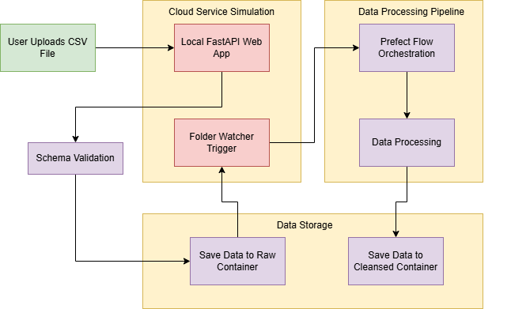

# Industrial IoT Data Pipeline with Cloud-Native Architecture Simulation
A complete data ingestion and processing pipeline that simulates cloud infrastructure using local tools. Processes industrial sensor data for predictive maintenance analytics with automated validation, cleansing, and orchestration.

## Flowchart

## ☁️ Cloud Architecture Simulation

| Cloud Component     | Local Simulation               | Implementation                                    |
|---------------------|-------------------------------|----------------------------------------------------|
| Azure Web App       |  FastAPI Web Application     | File upload interface with real-time validation     |
| Azure Functions     |  Folder Watcher Script       | Automated event-driven processing triggers          |
| Azure Data Lake     |  Local Directory Structure    | Raw and cleansed data storage layers               |
| Prefect Cloud       |  Local Prefect Orchestration | Workflow management and processing                  |

##  Key Features Implemented

- **File Upload Interface**: FastAPI web app with schema validation
- **Event-Driven Processing**: Folder watcher triggers automated processing
- **Data Quality Checks**: Validation using Great Expectation against configurable business rules
- **Metadata Extraction**: Automatic data profiling and statistics
- **Parquet Storage**: Optimized columnar storage format
- **Error Handling**: Robust exception handling and logging
- **Modular Design**: Separated tasks for maintainability

## Skills Demonstrated

- Python Data Engineering
- Prefect Workflow Orchestration
- FastAPI Web Development
- Data Validation & Cleansing
- Parquet File Format
- Modular Code Architecture
